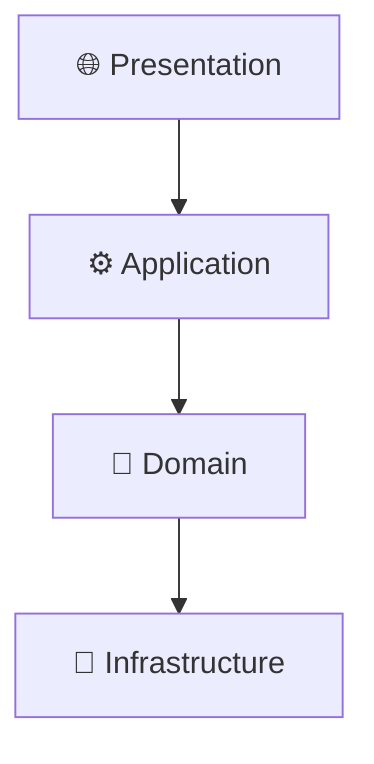
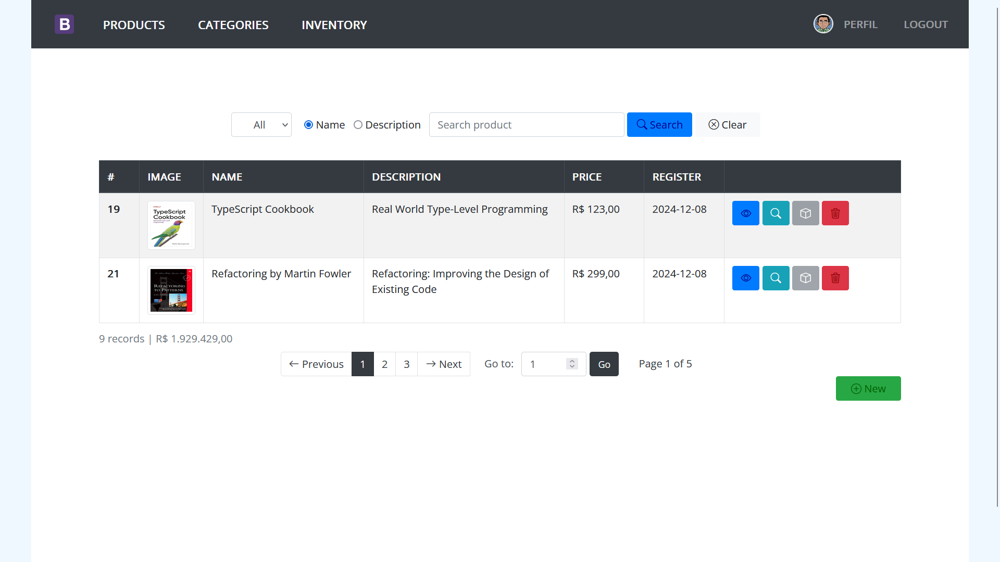
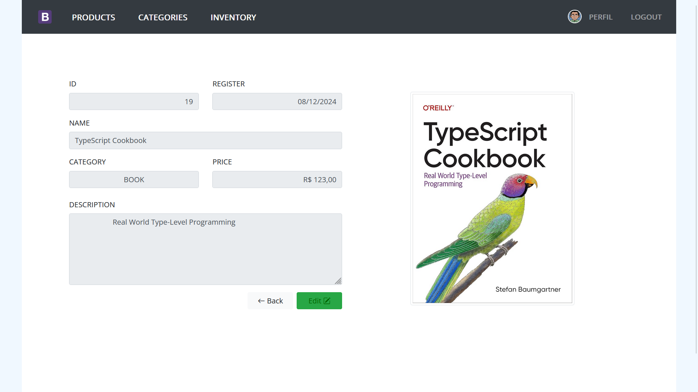

# Full-Stack Java EE Web Application

[](https://github.com/m-feliciano/servlets)
[](https://opensource.org/license/mit)
[](https://adoptopenjdk.net/)

---

Enterprise Java EE application implementing clean architecture principles with comprehensive security, caching, and testing infrastructure.

---

## 🚀 Quick Start

This is a production-ready Java EE application featuring clean architecture, JWT authentication, multi-layer caching, and comprehensive testing. Built with Java 17, Hibernate/JPA, and PostgreSQL.

**📚 [Complete Documentation](docs/en/)** | **🏗️ [Architecture Diagrams](docs/en/RELATIONSHIP_DIAGRAMS.md)** | **📋 [Project Summary](docs/en/PROJECT_SUMMARY.md)**

---

## 🏗️ Architecture



## ✨ Key Features

- JWT Authentication with roles
- Multi-level caching system  
- Clean Architecture (106 classes)
- Comprehensive testing (53 tests)
- Rate limiting & security
- Web scraping framework

## 🛠️ Technology Stack

| Component | Technology | Version |
|-----------|------------|---------|
| ☕ Language | Java | 17 |
| 🗄️ ORM | Hibernate/JPA | 6.2.7.Final |
| 🐘 Database | PostgreSQL | 42.5.4 |
| 🔐 Security | JWT + Roles | Custom |
| ⚡ Cache | EhCache | Multi-user |
| 🧪 Testing | JUnit + Mockito | 5.9.2 |

## 🚀 Getting Started

```bash
# Clone the repository
git clone https://github.com/m-feliciano/servlets.git

# Build and test
mvn clean test

# Deploy to Tomcat
mvn clean package
```

## 📖 Screenshots

<div align="center">
  
  <p><em>Homepage with product listing</em></p>

  
  <p><em>Product management interface</em></p>
</div>

## 📚 Documentation | Documentação

### 🇺🇸 English Documentation
- **[Complete Class Analysis](docs/en/COMPLETE_CLASS_ANALYSIS.md)** - Detailed analysis of all 106 classes
- **[Relationship Diagrams](docs/en/RELATIONSHIP_DIAGRAMS.md)** - Visual architecture diagrams  
- **[Project Summary](docs/en/PROJECT_SUMMARY.md)** - Executive summary and overview

### 🇧🇷 Documentação em Português  
- **[Análise Completa de Classes](docs/pt-BR/ANALISE_COMPLETA_CLASSES.md)** - Análise detalhada das 106 classes
- **[Diagramas de Relacionamentos](docs/pt-BR/DIAGRAMAS_RELACIONAMENTOS.md)** - Diagramas visuais da arquitetura
- **[Resumo do Projeto](docs/pt-BR/RESUMO_PROJETO.md)** - Resumo executivo e visão geral

---

## 📄 License

MIT License - see [LICENSE](LICENSE) file for details.