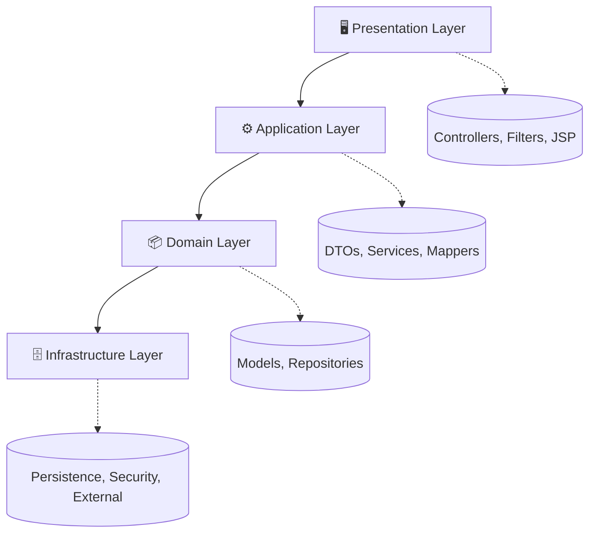
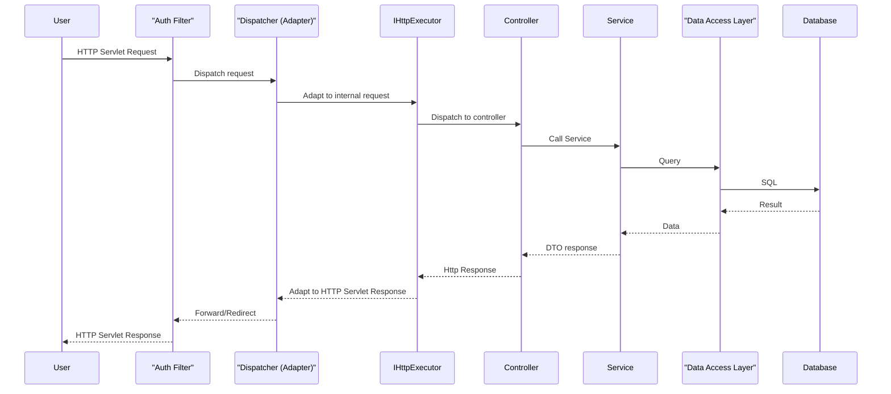
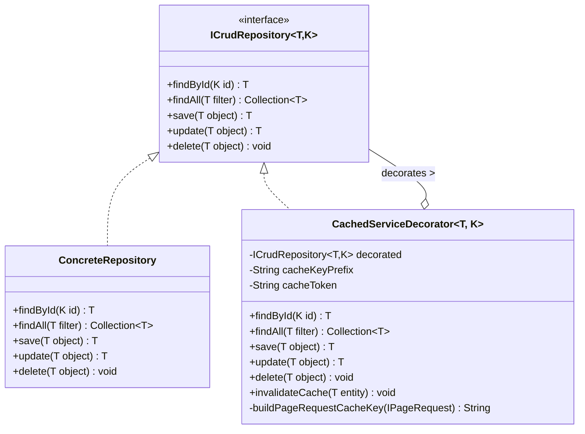
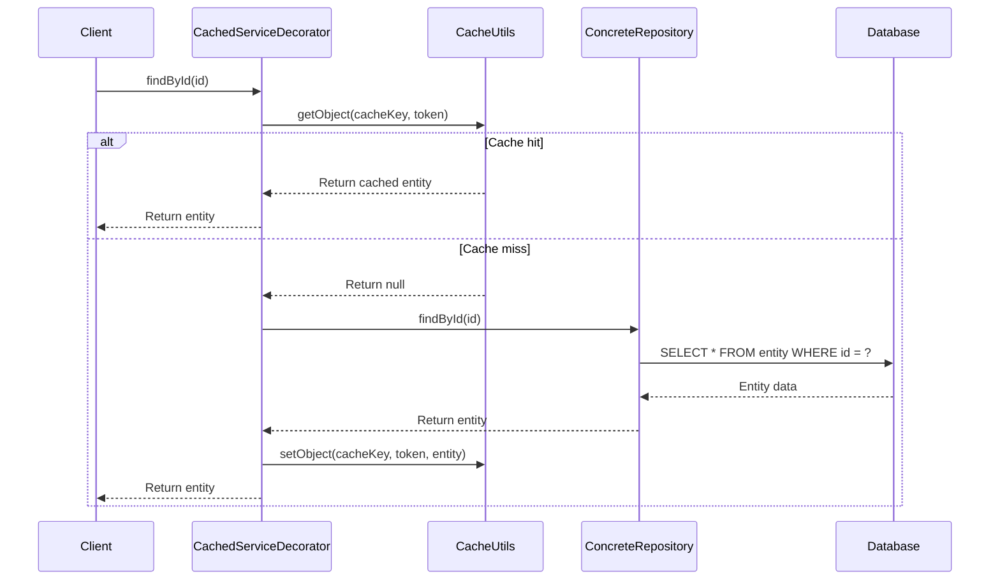
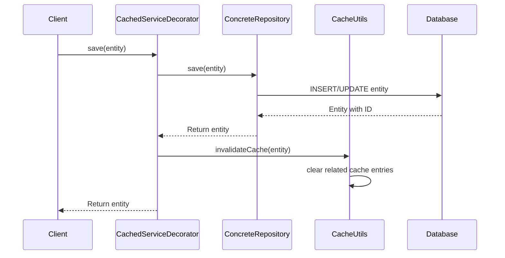
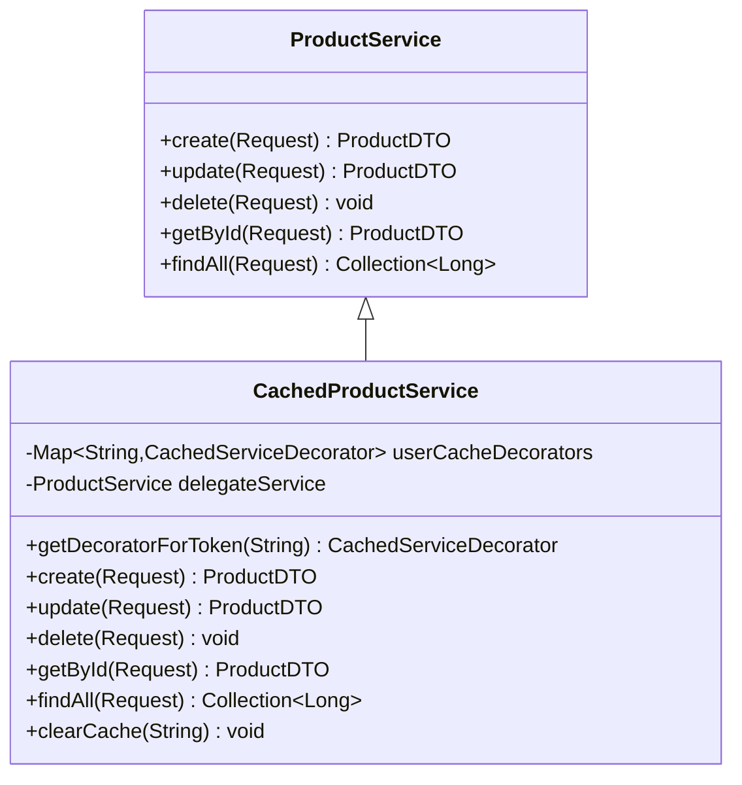

# Full-Stack Java EE Web Application

[](https://github.com/m-feliciano/servlets)
[](https://opensource.org/license/mit)
[](https://adoptopenjdk.net/)

> **Java EE web application with a modular MVC architecture, security, caching, and comprehensive automated testing.**

---

# 📚 Table of Contents

- [1. Project Overview](#1-project-overview)
  - [🚀 What is this project?](#-what-is-this-project)
  - [🏗️ Architecture Diagram](#️-architecture-diagram)
  - [🔄 Request Flow Diagram](#-request-flow-diagram)
  - [✨ Main Features](#-main-features)
  - [🛠️ Tech Stack](#️-tech-stack)
  - [📦 Package Structure Diagram](#-package-structure-diagram)
  - [🖼️ Layouts](#️-layouts)
- [2. Developer Guide](#2-developer-guide)
  - [Getting Started](#getting-started)
  - [⚙️ Configuration](#️-configuration)
  - [📚 Endpoints](#-endpoints)
  - [📑 Endpoints by Controller](#-endpoints-by-controller)
  - [🧩 Development Patterns](#-development-patterns)
  - [❓ FAQ](#-faq)
  - [���� Controller Example](#-controller-example)
- [3. 🗃️ Caching Architecture](#3-️-caching-architecture)
    - [🔄 Cache Implementation](#-cache-implementation)
    - [🏗️ Decorator Pattern](#️-decorator-pattern)
    - [📊 Cache Flow Diagram](#-cache-flow-diagram)
    - [💼 User-Specific Caching](#-user-specific-caching)
    - [🧠 Cache Eviction Strategy](#-cache-eviction-strategy)
- [4. 🕸️ Web Scraping Module](#4-️-web-scraping-module)
  - [🚦 Overview](#-overview)
  - [🗺️ Extension Flow](#-extension-flow)
  - [🛠️ Step by Step](#️-step-by-step)
  - [🎯 Example scraper response](#-example-scraper-response)

---

# 1. Project Overview

> **This section is for anyone interested in understanding the project, its architecture, features, and visual aspects.**

## 🚀 What is this project?

This is a production-grade Java EE web application, designed with extensibility and maintainability in mind.
It uses modern Java features, follows best practices, and demonstrates a layered architecture with separation of concerns.

## 🏗️ Architecture Diagram


```mermaid
graph TD
    A[🖥️ Presentation Layer] --> B[⚙️ Application Layer]
    B --> C[📦 Domain Layer]
    C --> D[🗄️ Infrastructure Layer]
    A -.-> E[(Controllers, Filters, JSP)]
    B -.-> F[(DTOs, Services, Mappers)]
    C -.-> G[(Models, Repositories)]
    D -.-> H[(Persistence, Security, External)]
```

*Description: The diagram above shows the system's layered architecture, where the presentation layer communicates with the application layer, which in turn accesses the domain layer, and this interacts with the infrastructure. The dashed arrows indicate examples of components in each layer.*

## 🔄 Request Flow Diagram


```mermaid
sequenceDiagram
    participant User
    participant Auth as "Auth Filter"
    participant ServletDispatcher as "Dispatcher (Adapter)"
    participant IHttpExecutor
    participant Controller
    participant Service
    participant Repository as "Data Access Layer"
    participant Database
    User ->> Auth: HTTP Servlet Request
    Auth ->> ServletDispatcher: Dispatch request
    ServletDispatcher ->> IHttpExecutor: Adapt to internal request
    IHttpExecutor ->> Controller: Dispatch to controller
    Controller ->> Service: Call Service
    Service ->> Repository: Query
    Repository ->> Database: SQL
    Database -->> Repository: Result
    Repository -->> Service: Data
    Service -->> Controller: DTO response
    Controller -->> IHttpExecutor: Http Response
    IHttpExecutor -->> ServletDispatcher: Adapt to HTTP Servlet Response
    ServletDispatcher -->> Auth: Forward/Redirect
    Auth -->> User: HTTP Servlet Response
```

*Description: This diagram illustrates the flow of an HTTP Servlet request and response through the authentication
filter, dispatcher (adapter), internal executor, controller, service, repository, and database. The Auth Filter
intercepts the request for authentication and authorization before passing it to the dispatcher, which adapts the
HttpServletRequest/HttpServletResponse to the internal request/response model. The response is then processed and
returned through the same layers, ensuring security and proper adaptation between the servlet and application layers.*

## ✨ Main Features

| 🚀 | Feature                        |
|----|--------------------------------|
| ✅ | Authentication with JWT         |
| 🛡️ | Security filters               |
| 🏷️ | Custom validation              |
| 📄 | Pagination & search            |
| 🗃️ | Caching for sessions           |
| 🧪 | Unit & integration tests        |
| 📋 | Structured logging             |
| 🏛️ | Layered MVC architecture       |

## 🛠️ Tech Stack

| Java | Hibernate/JPA | Tomcat | PostgreSQL | JUnit | Mockito | Lombok | SLF4J | Servlet API | Logback |
|------|---------------|--------|------------|-------|---------|--------|-------|-------------|---------|
| 17   | 6.2.7.Final   | 9      | 42.5.4     | 5.9.2 | 4.11.0  | 1.18.26| 2.0.7 | 4.0.1       | 1.4.7   |

## 📦 Package Structure Diagram


```mermaid
graph TD
    A[🖥️ presentation] --> A1[controller]
    A --> A2[filter]
    A --> A3[view]
    B[⚙️ application] --> B1[dto]
    B --> B2[service]
    B --> B3[mapper]
    C[📦 domain] --> C1[model]
    C --> C2[repository]
    D[🗄️ infrastructure] --> D1[persistence]
    D --> D2[security]
    D --> D3[external]
    E[🧩 core] --> E1[annotation]
    E --> E2[exception]
    E --> E3[interfaces]
    E --> E4[util]
    E --> E5[validator]
    F[⚙️ config]
    subgraph "com.dev.servlet"
        A
        B
        C
        D
        E
        F
    end

    %% Add click events to link to actual package locations
    click A href "https://github.com/m-feliciano/servlets/tree/master/src/main/java/com/dev/servlet/presentation" "View presentation package"
    click A1 href "https://github.com/m-feliciano/servlets/tree/master/src/main/java/com/dev/servlet/presentation/controller" "View controller package"
    click A2 href "https://github.com/m-feliciano/servlets/tree/master/src/main/java/com/dev/servlet/presentation/filter" "View filter package"
    click A3 href "https://github.com/m-feliciano/servlets/tree/master/src/main/java/com/dev/servlet/presentation/view" "View view package"
    
    click B href "https://github.com/m-feliciano/servlets/tree/master/src/main/java/com/dev/servlet/application" "View application package"
    click B1 href "https://github.com/m-feliciano/servlets/tree/master/src/main/java/com/dev/servlet/application/dto" "View dto package"
    click B2 href "https://github.com/m-feliciano/servlets/tree/master/src/main/java/com/dev/servlet/application/service" "View service package"
    click B3 href "https://github.com/m-feliciano/servlets/tree/master/src/main/java/com/dev/servlet/application/mapper" "View mapper package"
    
    click C href "https://github.com/m-feliciano/servlets/tree/master/src/main/java/com/dev/servlet/domain" "View domain package"
    click C1 href "https://github.com/m-feliciano/servlets/tree/master/src/main/java/com/dev/servlet/domain/model" "View model package"
    click C2 href "https://github.com/m-feliciano/servlets/tree/master/src/main/java/com/dev/servlet/domain/repository" "View repository package"
    
    click D href "https://github.com/m-feliciano/servlets/tree/master/src/main/java/com/dev/servlet/infrastructure" "View infrastructure package"
    click D1 href "https://github.com/m-feliciano/servlets/tree/master/src/main/java/com/dev/servlet/infrastructure/persistence" "View persistence package"
    click D2 href "https://github.com/m-feliciano/servlets/tree/master/src/main/java/com/dev/servlet/infrastructure/security" "View security package"
    click D3 href "https://github.com/m-feliciano/servlets/tree/master/src/main/java/com/dev/servlet/infrastructure/external" "View external package"
    
    click E href "https://github.com/m-feliciano/servlets/tree/master/src/main/java/com/dev/servlet/core" "View core package"
    click E1 href "https://github.com/m-feliciano/servlets/tree/master/src/main/java/com/dev/servlet/core/annotation" "View annotation package"
    click E2 href "https://github.com/m-feliciano/servlets/tree/master/src/main/java/com/dev/servlet/core/exception" "View exception package"
    click E3 href "https://github.com/m-feliciano/servlets/tree/master/src/main/java/com/dev/servlet/core/interfaces" "View interfaces package"
    click E4 href "https://github.com/m-feliciano/servlets/tree/master/src/main/java/com/dev/servlet/core/util" "View util package"
    click E5 href "https://github.com/m-feliciano/servlets/tree/master/src/main/java/com/dev/servlet/core/validator" "View validator package"
    
    click F href "https://github.com/m-feliciano/servlets/tree/master/src/main/java/com/dev/servlet/config" "View config package"
```

*Description: The diagram above represents the project's package structure, grouping the main modules and their subdivisions within the com.dev.servlet namespace.*

## 🖼️ Layouts

### Home


### Product


---

# 2. Developer Guide

> **This section is for developers who want to set up, contribute, or maintain the project.**

## Table of Contents
- [Getting Started](#getting-started)
- [Configuration](#configuration)
- [Endpoints](#endpoints)
- [Endpoints by Controller](#endpoints-by-controller)
- [Development Patterns](#development-patterns)
- [FAQ](#faq)
- [Controller Example](#controller-example)

## ⚡ Getting Started

### Prerequisites

- Java 17+
- Maven 3.x
- PostgreSQL
- Tomcat 9

### Setup

1. **Clone the repository**
   ```sh
   git clone https://github.com/m-feliciano/servlets.git
   cd servlets
   ```
2. **Configure the database**
   - Create a PostgreSQL database.
   - Update `src/main/resources/META-INF/persistence.xml` with your credentials.
   - Run the SQL scripts in `src/main/resources/META-INF/sql`.
3. **Build the project**
   ```sh
   mvn clean install
   ```
4. **Deploy to Tomcat**
   - Copy the generated WAR file from `target/` to Tomcat's `webapps` directory.
   - Start Tomcat and access the application at `http://localhost:8080/api/v1/login/form`.

---

## ⚙️ Configuration

| 📂 Type                | 📄 Path                                                        |
|------------------------|----------------------------------------------------------------|
| Database               | `src/main/resources/META-INF/persistence.xml`                  |
| General configuration  | `src/main/resources/app.properties`                            |
| SQL scripts            | `src/main/resources/META-INF/sql`                              |

---

## 📚 Endpoints

All endpoints follow the pattern: `/api/v{version}/{resource}/{action}`

### Example: Product Endpoints

| Method | Endpoint                      | Description           |
|--------|-------------------------------|-----------------------|
| GET    | /api/v1/product/list          | List all products     |
| GET    | /api/v1/product/list/{id}     | Product details       |
| POST   | /api/v1/product/update/{id}   | Update product        |

See the section [Endpoints by Controller](#endpoints-by-controller) for a complete list.

---

## 📑 Endpoints by Controller

### 🛒 ProductController

| ⚡ Method | 🌐 Endpoint                 | 🔐 Auth           | 📝 Notes            |
|----------|-----------------------------|-------------------|---------------------|
| 🟢 GET   | /api/v1/product/list        | 🔒 Yes (Required) | List all products   |
| 🟢 GET   | /api/v1/product/list/{id}   | 🔒 Yes (Required) | Product details     |
| 🟠 POST  | /api/v1/product/create      | 🔒 Yes (Required) | Create product      |
| 🟠 POST  | /api/v1/product/update/{id} | 🔒 Yes (Required) | Update product      |
| 🔴 POST  | /api/v1/product/delete/{id} | 🔒 Yes (Required) | Delete product      |
| �� GET   | /api/v1/product/new         | 🔒 Yes (Required) | New product form    |
| 🟢 GET   | /api/v1/product/edit/{id}   | 🔒 Yes (Required) | Edit product form   |
| 🟢 GET   | /api/v1/product/scrape      | 🔒 Yes (Required) | Scrape product data |

### 👤 UserController

| ⚡ Method | 🌐 Endpoint               | 🔐 Auth                | 📝 Notes            |
|----------|---------------------------|------------------------|---------------------|
| 🟠 POST  | /api/v1/user/update/{id}  | 🔒 Yes (Required)      | Update user         |
| 🔴 POST  | /api/v1/user/delete/{id}  | 🛡️ Admin (Admin only) | Delete user (admin) |
| 🟠 POST  | /api/v1/user/registerUser | 🔓 No (Public)         | Register new user   |
| 🟢 GET   | /api/v1/user/list/{id}    | 🔒 Yes (Required)      | User details        |

### 🔑 LoginController

| ⚡ Method | 🌐 Endpoint                | 🔐 Auth           | 📝 Notes          |
|----------|----------------------------|-------------------|-------------------|
| 🟢 GET   | /api/v1/login/registerPage | 🔓 No (Public)    | Registration form |
| 🟢 GET   | /api/v1/login/form         | 🔓 No (Public)    | Login form        |
| 🟠 POST  | /api/v1/login/login        | 🔓 No (Public)    | Perform login     |
| ��� POST | /api/v1/login/logout       | 🔒 Yes (Required) | Perform logout    |

---

## 🧩 Development Patterns

- Layered MVC architecture
- Dependency Injection (CDI)
- Custom validation annotations
- Security filters and encrypted passwords
- Caching for user sessions
- Pagination & sorting support
- Unit and integration tests
- Structured logging (SLF4J)

---

## ❓ FAQ

**How do I create a new service?**
- Implement DTO, Model, Repository, and Controller classes following the existing patterns.
- Annotate controller methods with `@RequestMapping` and use custom validators as needed.

See the [Controller Example](#controller-example) for a template.

**How do I customize configuration?**
- Edit `app.properties` for cache, rate limits, and other settings.

---

## 📝 Controller Example

```java
@Controller("/product")
public final class ProductController extends BaseController<Product, Long> {

    @Inject
    private ProductService productService;

    @RequestMapping(value = "/update/{id}", method = RequestMethod.POST)
    public IHttpResponse<Void> update(Request request) throws ServiceException {

        ProductDTO product = productService.update(request);
        return newHttpResponse(204, redirectTo(product.getId()));
    }

    // Example of a method that scrapes products from an external website
    @RequestMapping(value = "/scrape", method = RequestMethod.GET)
    public IHttpResponse<Void> scrape(Request request,
                                      @Property("env") String environment,
                                      @Property("scrape.product.url") String url) throws Exception {

        if (!"development".equals(environment)) {
            log.warn("Web scraping is only allowed in development environment");
            return HttpResponse.<Void>ok().next(redirectTo(LIST)).build();
        }

        var webScrapeRequest = new WebScrapeRequest("product", url, null);
        var webScrapeService = new WebScrapeService<List<ProductWebScrapeDTO>>(webScrapeServiceRegistry);

        Optional<List<ProductWebScrapeDTO>> response = webScrapeService.run(webScrapeRequest);
    }
}
```

---

# 3. 🗃️ Caching Architecture

> ⚡ **Robust caching system using the Decorator pattern to optimize performance and scale the application!**

The caching solution implemented in this project uses the **Decorator Pattern** to add caching capabilities to existing
service classes without modifying their original code.

## 🔄 Cache Implementation

The cache system is implemented in three main components:

1. **CacheUtils** - Central cache utility that manages the storage and retrieval of objects
2. **CachedServiceDecorator** - Generic decorator that adds cache behavior to any repository
3. **CachedProductService** - Specific implementation that uses per-user caching for products

The system utilizes the Ehcache library to manage in-memory storage, with support for:

- Automatic time-based expiration (TTL)
- Manual invalidation of specific entries
- Separate storage by user token for isolation
- Support for complex objects and collections

## 🏗️ Decorator Pattern

The Decorator pattern is implemented through the `CachedServiceDecorator<T, K>` class, which wraps any implementation of
`ICrudRepository<T, K>`. This pattern allows:

1. **Adding behavior** without altering the original implementation
2. **Dynamic composition** of functionality
3. **Transparency** for the client using the service


```mermaid
classDiagram
    class ICrudRepository~T,K~ {
<<interface>>
+findById(K id) T
+findAll(T filter) Collection~T~
+save(T object) T
+update(T object) T
+delete(T object) void
}

class ConcreteRepository {
+findById(K id) T
+findAll(T filter) Collection~T~
+save(T object) T
+update(T object) T
+delete(T object) void
}

class CachedServiceDecorator~T, K~ {
-ICrudRepository~T,K~ decorated
-String cacheKeyPrefix
-String cacheToken
+findById(K id) T
+findAll(T filter) Collection~T~
+save(T object) T
+update(T object) T
+delete(T object) void
+invalidateCache(T entity) void
-buildPageRequestCacheKey(IPageRequest) String
}

ICrudRepository <|.. ConcreteRepository
ICrudRepository <|.. CachedServiceDecorator
CachedServiceDecorator o-- ICrudRepository: decorates >
```

The diagram above shows how `CachedServiceDecorator` implements the same interface as the concrete repository, allowing
transparent substitution and the addition of caching behavior.

## 📊 Cache Flow Diagram

The cache access flow follows a check, read, and store pattern:


```mermaid
sequenceDiagram
    participant Client
    participant CachedService as CachedServiceDecorator
    participant CacheUtils
    participant Repository as ConcreteRepository
    participant Database
    Client ->> CachedService: findById(id)
    CachedService ->> CacheUtils: getObject(cacheKey, token)

    alt Cache hit
        CacheUtils -->> CachedService: Return cached entity
        CachedService -->> Client: Return entity
    else Cache miss
        CacheUtils -->> CachedService: Return null
        CachedService ->> Repository: findById(id)
        Repository ->> Database: SELECT * FROM entity WHERE id = ?
        Database -->> Repository: Entity data
        Repository -->> CachedService: Return entity
        CachedService ->> CacheUtils: setObject(cacheKey, token, entity)
        CachedService -->> Client: Return entity
    end
```

For write operations (`save`, `update`, `delete`), the flow includes cache invalidation:


```mermaid
sequenceDiagram
    participant Client
    participant CachedService as CachedServiceDecorator
    participant Repository as ConcreteRepository
    participant CacheUtils
    participant Database
    Client ->> CachedService: save(entity)
    CachedService ->> Repository: save(entity)
    Repository ->> Database: INSERT/UPDATE entity
    Database -->> Repository: Entity with ID
    Repository -->> CachedService: Return entity
    CachedService ->> CacheUtils: invalidateCache(entity)
    CacheUtils ->> CacheUtils: clear related cache entries
    CachedService -->> Client: Return entity
```

## 💼 User-Specific Caching

An important feature of the implementation is cache isolation by user, through the `CachedProductService` class:


```mermaid
classDiagram
    class ProductService {
        +create(Request) ProductDTO
        +update(Request) ProductDTO
        +delete(Request) void
        +getById(Request) ProductDTO
        +findAll(Request) Collection~Long~
    }

    class CachedProductService {
        -Map~String,CachedServiceDecorator~ userCacheDecorators
        -ProductService delegateService
        +getDecoratorForToken(String) CachedServiceDecorator
        +create(Request) ProductDTO
        +update(Request) ProductDTO
        +delete(Request) void
        +getById(Request) ProductDTO
        +findAll(Request) Collection~Long~
        +clearCache(String) void
    }

    ProductService <|-- CachedProductService
```

The `CachedProductService` maintains a map of decorators per user token, ensuring that:

1. Each user has their own isolated cache space
2. Updates by one user do not affect the cache of other users
3. A user's session can be completely invalidated if needed

## 🧠 Cache Eviction Strategy

The system implements various invalidation strategies to maintain consistency:

1. **Entity-based invalidation** - When changing an entity, all related cache entries are invalidated
2. **Collection invalidation** - When changing any entity, cached collections are invalidated
3. **User-based invalidation** - A user's cache can be completely cleared on logout
4. **Automatic expiration** - Cache entries automatically expire after a configurable period
5. **Idle cache cleaning** - Unused caches are periodically removed to free up memory

---

The implemented caching solution significantly increases system performance, reducing database load and improving
response times, especially for frequent read operations. Using the Decorator pattern keeps the code clean, modular, and
easy to maintain.
