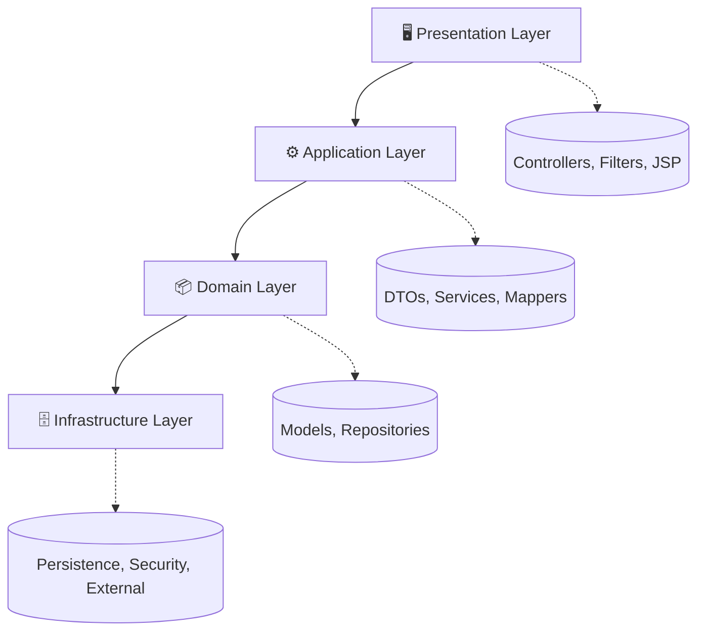
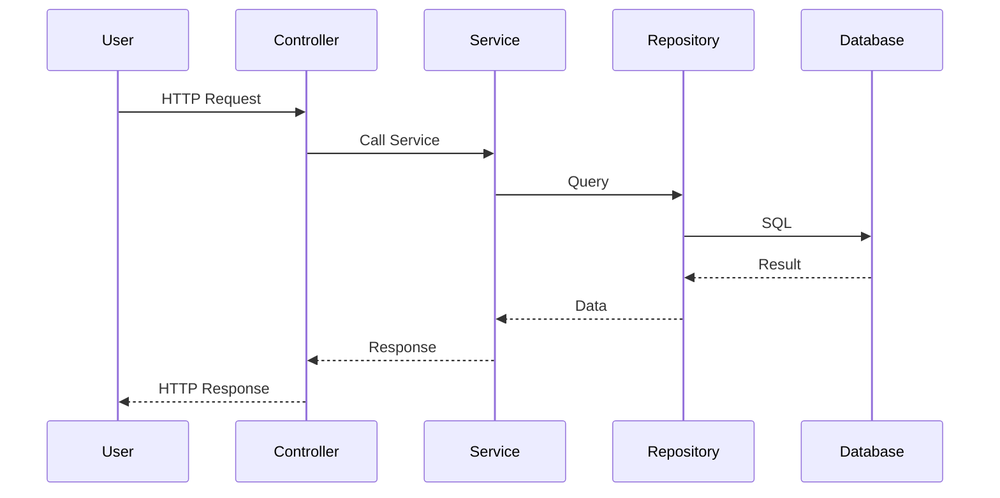
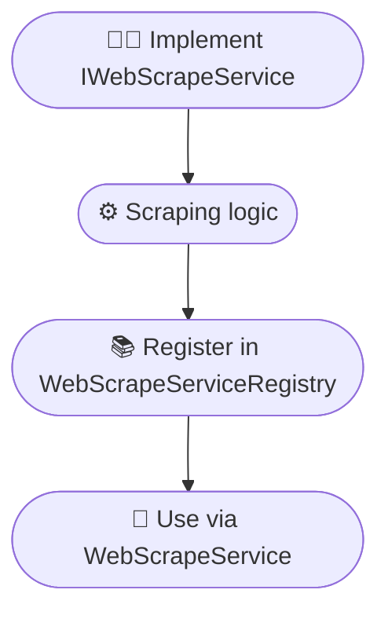

# Full-Stack Java EE Web Application

[](https://github.com/m-feliciano/servlets)
[](https://opensource.org/license/mit)
[](https://adoptopenjdk.net/)

> **Java EE web application with a modular MVC architecture, security, caching, and comprehensive automated testing.**

---

# 📚 Table of Contents

- [1. Project Overview](#1-project-overview)
  - [🚀 What is this project?](#-what-is-this-project)
  - [🏗️ Architecture Diagram](#️-architecture-diagram)
  - [🔄 Request Flow Diagram](#-request-flow-diagram)
  - [✨ Main Features](#-main-features)
  - [🛠️ Tech Stack](#️-tech-stack)
  - [📦 Package Structure Diagram](#-package-structure-diagram)
  - [🖼️ Layouts](#️-layouts)
- [2. Developer Guide](#2-developer-guide)
  - [Getting Started](#getting-started)
  - [⚙️ Configuration](#️-configuration)
  - [📚 Endpoints](#-endpoints)
  - [📑 Endpoints by Controller](#-endpoints-by-controller)
  - [🧩 Development Patterns](#-development-patterns)
  - [❓ FAQ](#-faq)
  - [📝 Controller Example](#-controller-example)
- [2. 🕸️ Web Scraping Module](#2-️-web-scraping-module)
  - [🚦 Overview](#-overview)
  - [🗺️ Extension Flow](#-extension-flow)
  - [🛠️ Step by Step](#️-step-by-step)
  - [🎯 Example scraper response](#-example-scraper-response)

---

# 1. Project Overview

> **This section is for anyone interested in understanding the project, its architecture, features, and visual aspects.**

## 🚀 What is this project?

This is a production-grade Java EE web application, designed with extensibility and maintainability in mind.
It uses modern Java features, follows best practices, and demonstrates a layered architecture with separation of concerns.

## 🏗️ Architecture Diagram


```mermaid
graph TD
    A[🖥️ Presentation Layer] --> B[⚙️ Application Layer]
    B --> C[📦 Domain Layer]
    C --> D[🗄️ Infrastructure Layer]
    A -.-> E[(Controllers, Filters, JSP)]
    B -.-> F[(DTOs, Services, Mappers)]
    C -.-> G[(Models, Repositories)]
    D -.-> H[(Persistence, Security, External)]
```

*Description: The diagram above shows the system's layered architecture, where the presentation layer communicates with the application layer, which in turn accesses the domain layer, and this interacts with the infrastructure. The dashed arrows indicate examples of components in each layer.*

## 🔄 Request Flow Diagram


```mermaid
sequenceDiagram
    participant User
    participant Controller
    participant Service
    participant Repository
    participant Database
    User->>Controller: HTTP Request
    Controller->>Service: Call Service
    Service->>Repository: Query
    Repository->>Database: SQL
    Database-->>Repository: Result
    Repository-->>Service: Data
    Service-->>Controller: Response
    Controller-->>User: HTTP Response
```

*Description: This diagram illustrates the flow of an HTTP request, from the user to the database and back, passing through controller, service, and repository.*

## ✨ Main Features

| 🚀 | Feature                        |
|----|--------------------------------|
| ✅ | Authentication with JWT         |
| 🛡️ | Security filters               |
| 🏷️ | Custom validation              |
| 📄 | Pagination & search            |
| 🗃️ | Caching for sessions           |
| 🧪 | Unit & integration tests        |
| 📋 | Structured logging             |
| 🏛️ | Layered MVC architecture       |

## 🛠️ Tech Stack

| Java | Hibernate/JPA | Tomcat | PostgreSQL | JUnit | Mockito | Lombok | SLF4J | Servlet API | Logback |
|------|---------------|--------|------------|-------|---------|--------|-------|-------------|---------|
| 17   | 6.2.7.Final   | 9      | 42.5.4     | 5.9.2 | 4.11.0  | 1.18.26| 2.0.7 | 4.0.1       | 1.4.7   |

## 📦 Package Structure Diagram


```mermaid
graph TD
    A[🖥️ presentation] --> A1[controller]
    A --> A2[filter]
    A --> A3[view]
    B[⚙️ application] --> B1[dto]
    B --> B2[service]
    B --> B3[mapper]
    C[📦 domain] --> C1[model]
    C --> C2[repository]
    D[🗄️ infrastructure] --> D1[persistence]
    D --> D2[security]
    D --> D3[external]
    E[🧩 core] --> E1[annotation]
    E --> E2[exception]
    E --> E3[interfaces]
    E --> E4[util]
    E --> E5[validator]
    F[⚙️ config]
    subgraph "com.dev.servlet"
        A
        B
        C
        D
        E
        F
    end

    %% Add click events to link to actual package locations
    click A href "https://github.com/m-feliciano/servlets/tree/master/src/main/java/com/dev/servlet/presentation" "View presentation package"
    click A1 href "https://github.com/m-feliciano/servlets/tree/master/src/main/java/com/dev/servlet/presentation/controller" "View controller package"
    click A2 href "https://github.com/m-feliciano/servlets/tree/master/src/main/java/com/dev/servlet/presentation/filter" "View filter package"
    click A3 href "https://github.com/m-feliciano/servlets/tree/master/src/main/java/com/dev/servlet/presentation/view" "View view package"
    
    click B href "https://github.com/m-feliciano/servlets/tree/master/src/main/java/com/dev/servlet/application" "View application package"
    click B1 href "https://github.com/m-feliciano/servlets/tree/master/src/main/java/com/dev/servlet/application/dto" "View dto package"
    click B2 href "https://github.com/m-feliciano/servlets/tree/master/src/main/java/com/dev/servlet/application/service" "View service package"
    click B3 href "https://github.com/m-feliciano/servlets/tree/master/src/main/java/com/dev/servlet/application/mapper" "View mapper package"
    
    click C href "https://github.com/m-feliciano/servlets/tree/master/src/main/java/com/dev/servlet/domain" "View domain package"
    click C1 href "https://github.com/m-feliciano/servlets/tree/master/src/main/java/com/dev/servlet/domain/model" "View model package"
    click C2 href "https://github.com/m-feliciano/servlets/tree/master/src/main/java/com/dev/servlet/domain/repository" "View repository package"
    
    click D href "https://github.com/m-feliciano/servlets/tree/master/src/main/java/com/dev/servlet/infrastructure" "View infrastructure package"
    click D1 href "https://github.com/m-feliciano/servlets/tree/master/src/main/java/com/dev/servlet/infrastructure/persistence" "View persistence package"
    click D2 href "https://github.com/m-feliciano/servlets/tree/master/src/main/java/com/dev/servlet/infrastructure/security" "View security package"
    click D3 href "https://github.com/m-feliciano/servlets/tree/master/src/main/java/com/dev/servlet/infrastructure/external" "View external package"
    
    click E href "https://github.com/m-feliciano/servlets/tree/master/src/main/java/com/dev/servlet/core" "View core package"
    click E1 href "https://github.com/m-feliciano/servlets/tree/master/src/main/java/com/dev/servlet/core/annotation" "View annotation package"
    click E2 href "https://github.com/m-feliciano/servlets/tree/master/src/main/java/com/dev/servlet/core/exception" "View exception package"
    click E3 href "https://github.com/m-feliciano/servlets/tree/master/src/main/java/com/dev/servlet/core/interfaces" "View interfaces package"
    click E4 href "https://github.com/m-feliciano/servlets/tree/master/src/main/java/com/dev/servlet/core/util" "View util package"
    click E5 href "https://github.com/m-feliciano/servlets/tree/master/src/main/java/com/dev/servlet/core/validator" "View validator package"
    
    click F href "https://github.com/m-feliciano/servlets/tree/master/src/main/java/com/dev/servlet/config" "View config package"
```

*Description: The diagram above represents the project's package structure, grouping the main modules and their subdivisions within the com.dev.servlet namespace.*

## 🖼️ Layouts

### Home


### Product


---

# 2. Developer Guide

> **This section is for developers who want to set up, contribute, or maintain the project.**

## Table of Contents
- [Getting Started](#getting-started)
- [Configuration](#configuration)
- [Endpoints](#endpoints)
- [Endpoints by Controller](#endpoints-by-controller)
- [Development Patterns](#development-patterns)
- [FAQ](#faq)
- [Controller Example](#controller-example)

## ⚡ Getting Started

### Prerequisites

- Java 17+
- Maven 3.x
- PostgreSQL
- Tomcat 9

### Setup

1. **Clone the repository**
   ```sh
   git clone https://github.com/m-feliciano/servlets.git
   cd servlets
   ```
2. **Configure the database**
   - Create a PostgreSQL database.
   - Update `src/main/resources/META-INF/persistence.xml` with your credentials.
   - Run the SQL scripts in `src/main/resources/META-INF/sql`.
3. **Build the project**
   ```sh
   mvn clean install
   ```
4. **Deploy to Tomcat**
   - Copy the generated WAR file from `target/` to Tomcat's `webapps` directory.
   - Start Tomcat and access the application at `http://localhost:8080/api/v1/login/form`.

---

## ⚙️ Configuration

| 📂 Type                | 📄 Path                                                        |
|------------------------|----------------------------------------------------------------|
| Database               | `src/main/resources/META-INF/persistence.xml`                  |
| General configuration  | `src/main/resources/app.properties`                            |
| SQL scripts            | `src/main/resources/META-INF/sql`                              |

---

## 📚 Endpoints

All endpoints follow the pattern: `/api/v{version}/{resource}/{action}`

### Example: Product Endpoints

| Method | Endpoint                      | Description           |
|--------|-------------------------------|-----------------------|
| GET    | /api/v1/product/list          | List all products     |
| GET    | /api/v1/product/list/{id}     | Product details       |
| POST   | /api/v1/product/update/{id}   | Update product        |

See the section [Endpoints by Controller](#endpoints-by-controller) for a complete list.

---

## 📑 Endpoints by Controller

### 🛒 ProductController

| ⚡ Method | 🌐 Endpoint                      | 🔐 Auth  | 📝 Notes                |
|----------|----------------------------------|----------|------------------------|
| 🟢 GET   | /api/v1/product/list             | 🔒 Yes (Authentication required)   | List all products      |
| 🟢 GET   | /api/v1/product/list/{id}        | 🔒 Yes (Authentication required)   | Product details        |
| 🟠 POST  | /api/v1/product/create           | 🔒 Yes (Authentication required)   | Create product         |
| 🟠 POST  | /api/v1/product/update/{id}      | 🔒 Yes (Authentication required)   | Update product         |
| 🔴 POST  | /api/v1/product/delete/{id}      | 🔒 Yes (Authentication required)   | Delete product         |
| �� GET   | /api/v1/product/new              | 🔒 Yes (Authentication required)   | New product form       |
| 🟢 GET   | /api/v1/product/edit/{id}        | 🔒 Yes (Authentication required)   | Edit product form      |
| 🟢 GET   | /api/v1/product/scrape           | 🔒 Yes (Authentication required)   | Scrape product data    |

### 👤 UserController

| ⚡ Method | 🌐 Endpoint                  | 🔐 Auth   | 📝 Notes                |
|----------|------------------------------|-----------|------------------------|
| 🟠 POST  | /api/v1/user/update/{id}     | 🔒 Yes (Authentication required)    | Update user            |
| 🔴 POST  | /api/v1/user/delete/{id}     | 🛡️ Admin (Admin only)               | Delete user (admin)    |
| 🟠 POST  | /api/v1/user/registerUser    | 🔓 No (Public)                      | Register new user      |
| 🟢 GET   | /api/v1/user/list/{id}       | 🔒 Yes (Authentication required)    | User details           |

### 🔑 LoginController

| ⚡ Method | 🌐 Endpoint                   | 🔐 Auth | 📝 Notes             |
|----------|-------------------------------|---------|----------------------|
| 🟢 GET   | /api/v1/login/registerPage    | 🔓 No (Public)   | Registration form    |
| 🟢 GET   | /api/v1/login/form            | 🔓 No (Public)   | Login form           |
| 🟠 POST  | /api/v1/login/login           | 🔓 No (Public)   | Perform login        |
| 🟠 POST  | /api/v1/login/logout          | 🔒 Yes (Authentication required)  | Perform logout       |

---

## 🧩 Development Patterns

- Layered MVC architecture
- Dependency Injection (CDI)
- Custom validation annotations
- Security filters and encrypted passwords
- Caching for user sessions
- Pagination & sorting support
- Unit and integration tests
- Structured logging (SLF4J)

---

## ❓ FAQ

**How do I create a new service?**
- Implement DTO, Model, Repository, and Controller classes following the existing patterns.
- Annotate controller methods with `@RequestMapping` and use custom validators as needed.

See the [Controller Example](#controller-example) for a template.

**How do I customize configuration?**
- Edit `app.properties` for cache, rate limits, and other settings.

---

## 📝 Controller Example

```java
@Controller("/product")
public final class ProductController extends BaseController<Product, Long> {

    @Inject
    private ProductService productService;

    @RequestMapping(value = "/update/{id}", method = RequestMethod.POST)
    public IHttpResponse<Void> update(Request request) throws ServiceException {

        ProductDTO product = productService.update(request);
        return newHttpResponse(204, redirectTo(product.getId()));
    }

    // Example of a method that scrapes products from an external website
    @RequestMapping(value = "/scrape", method = RequestMethod.GET)
    public IHttpResponse<Void> scrape(Request request, @Property("scrape.product.url") String url) throws Exception {

        var webScrapeRequest = new WebScrapeRequest("product", url, null);
        var registry = new WebScrapeServiceRegistry();
        var webScrapeService = new WebScrapeService<List<ProductWebScrapeDTO>>(registry);

        Optional<List<ProductWebScrapeDTO>> response = webScrapeService.run(webScrapeRequest);
    }
}
```

---

# 2. 🕸️ Web Scraping Module

> ⚡ **Extensible module for integrating multiple external scrapers, secure and easy to evolve!**

---

## 🚦 Overview

- 🔄 Based on **generics** for multiple types of scraping.
- ➕ Add new scrapers without changing the core.
- 🧩 Service registration and delegation.

---

## 🗺️ Extension Flow


```mermaid
flowchart TD
    A([🧑‍💻 Implement IWebScrapeService<T>]) --> B([⚙️ Scraping logic])
    B --> C([📚 Register in WebScrapeServiceRegistry])
    C --> D([🚀 Use via WebScrapeService<T>])
```

---

## 🛠️ Step by Step

1. 🧑‍💻 **Implement the interface**
   ```java
   public class MyCustomScraper implements IWebScrapeService<MyDTO> {
       @Override
       public Optional<MyDTO> scrape(WebScrapeRequest request) {
           // Your scraping logic here
       }
   }
   ```
2. 📚 **Register the service**
   ```java
   registry.registerService("my-custom", new MyCustomScraper());
   ```
3. 🚀 **Use the service**
   ```java
   WebScrapeService<MyDTO> service = new WebScrapeService<>(registry);
   Optional<MyDTO> result = service.run(request);
   ```

---

## 🎯 Example scraper response

```json
{
  "order": "asc",
  "total_results": 28,
  "next_url": "https://web-scraping.dev/api/products?page=6&order=asc",
  "results": [
    {
      "name": "Product A",
      "price": 99.90,
      "url": "https://site.com/product-a",
      "category": "category"
    }
  ],
  "page_number": 5,
  "page_size": 5,
  "page_total": 6
}
```

[Back to top](#full-stack-java-ee-web-application)