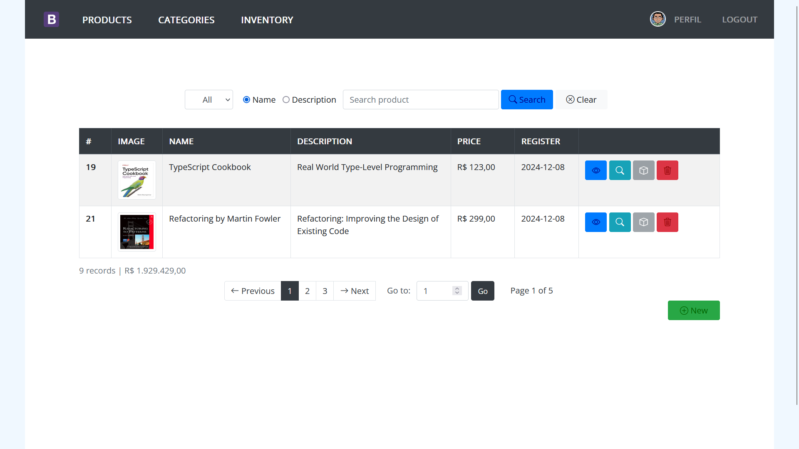
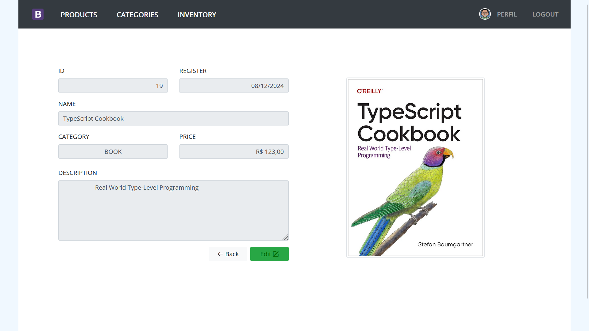
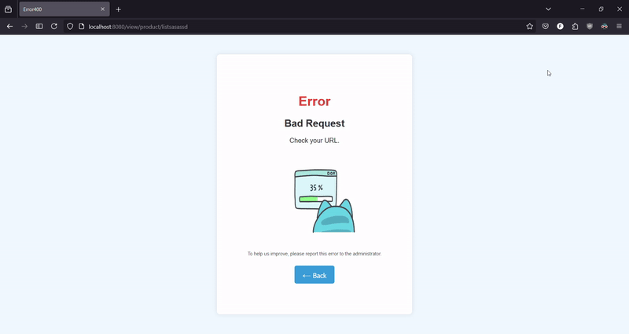

# Full-Stack Java Web Application

This project is a comprehensive Java/JSP web application.
It follows the Model-View-Controller (MVC) architecture and uses the Java EE stack.
I've used the latest Java features and best practices to build this application.

## Table of Contents

- [Technology Stack](#tech-stack)
- [URL Design](#url-design)
- [Layout](#Some-layouts)
- [Packages](#packages)
- [Setup Instructions](#setup-instructions)
- [Notes](#notes)

## Tech Stack

- **Java (JDK 17)**: Core programming language.
- **Hibernate (ORM)**: Simplifies database interactions.
- **Tomcat 9 (Server)**: Web server and servlet container.
- **PostgreSQL (Database)**: Open-source relational database management system.
- **Criteria API**: Type-safe way to build database queries.
- **Mockito**: For unit testing.

## URL Design
### URL Components:
- **`{context}`**: Application context path (e.g., `https://your-domain.com/api`).
- **`{version}`**: API version (e.g., `v1`).
- **`{path}`**: Controller path (e.g., `product`).
- **`{service}`**: Specific service or action (e.g., `list`).
- **`{query}`**: Optional query parameters (e.g., `?page=1&limit=5`).

### Examples:

#### GET Requests:
- `/api/v1/product/list` - List all products.
- `/api/v1/product/list/{id}` - Get product by ID.

#### POST Requests:
- `/api/v1/product/update/{id}` - Update a product.
- `/api/v1/product/delete/{id}` - Delete a product.

### Query Parameters:
- **Sorting**: `sort=<field>&order=<asc|desc>` (e.g., `sort=id&order=asc`).
- **Pagination**: `page=<page>&limit=<size>` (e.g., `page=1&limit=5`).
- **Search**: `q=<query>&k=<field>` (e.g., `q=macbook&k=name`).

### Notes:
- Default values for query parameters can be configured in the `app.properties` file.
- API versioning is included in the URL but not mapped to controllers. The default version is `v1`.

#### Example of controller

```java

// Example of a controller
   @Controller(path = "/product")
   public final class ProductController extends BaseController<Product, Long> {
   
      @RequestMapping(value = "/list")
      public IServletResponse list(Request request) {
         ProductModel model = this.getModel();
         Product filter = model.getEntity(request);

         request.query().getPageRequest().setFilter(filter);

         IPageable<Product> pageable = model.getAllPageable(request.query().getPageRequest());

         Set<KeyPair> container = new HashSet<>();
         container.add(new KeyPair("pageable", pageable));

         if (pageable.getContent().iterator().hasNext()) {
            BigDecimal totalPrice = model.calculateTotalPriceFor(filter);
            container.add(new KeyPair("totalPrice", totalPrice));
         }

         Collection<CategoryDTO> categories = categoryController.list(request.withToken()).body();
         container.add(new KeyPair("categories", categories));

         String next = super.forwardTo("listProducts");
         return super.newServletResponse(container, next);
      }
   }
```

#### Endpoint register user

```java
    // POST ap1/v2/user/registerUser
   @RequestMapping(
           value = "/registerUser",
           method = RequestMethod.POST,
           apiVersion = "v2",
           requestAuth = false,
           validators = {
                   @Validator(values = "login", constraints = {
                           @Constraints(isEmail = true, message = "Login must be a valid email")
                   }),
                   @Validator(values = {"password", "confirmPassword"},
                           constraints = {
   //                                @Constraints(minLength = 5, maxLength = 30, message = "Password must be between {0} and {1} characters")
                                   @Constraints(minLength = 5, message = "Password must have at least {0} characters"),
                                   @Constraints(maxLength = 30, message = "Password must have at most {0} characters"),
                           }),
           })
   public IHttpResponse<Void> register(Request request) {
      UserModel model = this.getModel();
      model.register(request);
      return super.newHttpResponse(201, "redirect:/api/v1/login/form"); // Created
   }
```

#### Endpoint delete user (Only admin)

```java
   // POST /user/delete/{id}
   @RequestMapping(
           value = "/delete/{id}",
           method = RequestMethod.POST,
           roles = { 
                   PerfilEnum.ADMIN
           },
           validators = {
                   @Validator(values = "id", constraints = {
                           @Constraints(min = 1, message = "ID must be greater than or equal to {0}")
                   })
           })
   public IHttpResponse<Void> delete(Request request) {
      UserModel model = this.getModel();
      model.delete(request);

      String next = super.forwardTo("formLogin");
      return HttpResponse.<Void>ok().next(next).build();
   }
```

#### Testing 

```java
   // ProductControllerTest.java
    @Test
    @DisplayName(
            "Test listProducts method to retrieve a list of products. " +
            "It should return a 200 status code and the expected response.")
    @SuppressWarnings("unchecked")
    void testListProducts() {
        // Setup
        Product filterMock = new Product("prod", "desc", null);
        when(productModel.getEntity(any())).thenReturn(filterMock);
    
        var categories = List.of(new CategoryDTO());
        var categoryResponse = HttpResponseImpl.<Collection<CategoryDTO>>newBuilder().body(categories).build();
        when(categoryController.list(any())).thenReturn(categoryResponse);
    
        var products = List.of(
                new Product("prod1", "desc1", BigDecimal.valueOf(50)),
                new Product("prod2", "desc2", BigDecimal.valueOf(50))
        );
    
        var pageableMock = PageableImpl.<Product>builder()
                .content(products)
                .currentPage(1)
                .pageSize(2)
                .sort(Sort.by("id").ascending())
                .build();
    
        when(productModel.getAllPageable(any())).thenReturn(pageableMock);
        when(productModel.calculateTotalPriceFor(any())).thenReturn(BigDecimal.valueOf(100));
    
        // Execution
        IServletResponse response = productController.list(request);
    
        // Verification
        assertNotNull(response);
        assertEquals(200, response.statusCode());
    
        // Verify pageable content
        var pageable = (IPageable<Product>) response.body().stream()
                .filter(pair -> "pageable".equals(pair.key()))
                .findFirst()
                .orElseThrow(() -> new AssertionError("Pageable not found"))
                .value();
    
        long counter = StreamSupport.stream(pageable.getContent().spliterator(), false).count();
        assertEquals(2, counter);
    
        // Verify total price
        BigDecimal totalPrice = (BigDecimal) response.body().stream()
                .filter(pair -> "totalPrice".equals(pair.key()))
                .findFirst()
                .orElseThrow(() -> new AssertionError("Total price not found"))
                .value();
    
        assertEquals(BigDecimal.valueOf(100), totalPrice);
    
        // Verify categories
        var responseCategories = (Collection<CategoryDTO>) response.body().stream()
                .filter(pair -> "categories".equals(pair.key()))
                .findFirst()
                .orElseThrow(() -> new AssertionError("Categories not found"))
                .value();
        assertEquals(categories, responseCategories);
    
        // Verify interactions
        verify(productModel, times(1)).getEntity(request);
        verify(productModel, times(1)).getAllPageable(any());
        verify(productModel, times(1)).calculateTotalPriceFor(filterMock);
        verify(categoryController, times(1)).list(any());
    }
```

### Creating a new Service
```java
   // 1. DTO
   public class ExampleDTO { ... }
   
   // 2. Entidade
   public class Example extends Identifier<Long> { ... }
   
   // 3. DAO
   public class ExampleDAO extends BaseDAO<Example, Long> { ... }
   
   // 4. Model
   public class ExampleModel extends BaseModel<Example, Long> { ... }
   
   // 5. Controller
   @Controller(path = "/example")
   public class ExampleController extends BaseController<Example, Long> {
       @RequestMapping(value = "/create", method = RequestMethod.POST)
       public IHttpResponse<Void> create(Request request) { ... }
       // other methods...
   }
```

## Some layouts

### Home Page

#### `/product/?page=1&limit=3&sort=id&order=asc`



Default values can be changed in the `app.properties` file.

### Product

#### `/product/list/{id}`



### Info Page

[comment]: <> (Found on the web, author unknown)


## Packages

```plaintext
C:.
├───main
│   ├───java
│   │   └───com
│   │       └───dev
│   │           └───servlet
│   │               ├───Auth
│   │               │   └───wrapper
│   │               ├───controller
│   │               │   └───base
│   │               ├───core
│   │               │   ├───builder
│   │               │   ├───impl
│   │               │   ├───interceptor
│   │               │   └───listener
│   │               ├───dto
│   │               ├───exception
│   │               ├───mapper
│   │               ├───model
│   │               │   ├───base
│   │               │   ├───impl
│   │               │   ├───pojo
│   │               │   │   ├───domain
│   │               │   │   ├───enums
│   │               │   │   └───records
│   │               │   └───shared
│   │               ├───persistence
│   │               │   ├───dao
│   │               │   │   └───base
│   │               │   └───impl
│   │               ├───util
│   │               └───validator
│   ├───resources
│   │   ├───META-INF
│   │   │   └───sql
│   │   └───mockito-extensions
│   └───webapp
│       ├───assets
│       │   └───images
│       ├───css
│       ├───js
│       ├───META-INF
│       ├───web
│       │   └───WEB-INF
│       └───WEB-INF
│           ├───fragments
│           ├───routes
│           └───view
│               ├───components
│               │   └───buttons
│               └───pages
│                   ├───category
│                   ├───inventory
│                   ├───product
│                   └───user
└───test
    └───java
        └───servlets
            ├───auth
            ├───controllers
            ├───core
            └───utils
```

## Setup Instructions

1. Clone the repository:
    ```sh
    git clone https://github.com/m-feliciano/servlets.git
    ```
2. Navigate to the project directory:
    ```sh
    cd servlets
    ```
3. Build the project using Maven:
    ```sh
    mvn clean install
    ```
4. Create a new database in PostgreSQL:
    ```docker
   ## create network
    docker network create -d bridge <network-name>
    
    ## run container (example)
    docker run --name <container-name> \
    --network=<network-name> -p 5432:5432 \
    -e "POSTGRES_USER=<user>" \
    -e "POSTGRES_PASSWORD=<password>" \
    -d postgres
    
    ## exec into container
    docker exec -it <container-name> psql -U postgres
    ## create table
    
    ## etc
    # The scripts to create the database are in the `resources/META-INF/sql` folder.
    # The database connection is set in the `resources/META-INF/persistence.xml` file.
    ```

5. Setting up the database:
    - Run the scripts in the `resources/META-INF/sql` folder to create the tables and insert initial data.
    - Update the `persistence.xml` file with your database credentials.
    - Update the `app.properties` file as needed.
      <br><br>
6. Deploy the application to Tomcat:
    - Install Tomcat 9 on your machine.
    - Copy the generated WAR file to the Tomcat `webapps` directory.
    - Start the Tomcat server.
      <br><br>
7. Usage Instructions
    - Access the application at `<server>/<context-path>` (e.g., `http://localhost:8080/api/v1/login/form`).

## Notes

***Note***: This project was initially created years ago to learn Java EE, core Servlet/JSP, and JPA. It has been
updated to incorporate the latest Java features and best practices.

There is a lot of room for improvement,
like refactoring the frontend joining the files into a single one using `JSP fragments`,
and `JSTL` to render the content dynamically.

[Back to top](#full-stack-java-web-application)